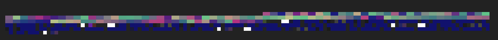

# dough



good for baking. wip synth engine that runs natively and in the browser.

see [the superdough puzzle](https://garten.salat.dev/audio-in-c/puzzle.html) for details.

## Demo

dough is deployed at [dough.strudel.cc](https://dough.strudel.cc/).

## contributing

in this repository, we practise jam oriented programming. this means:

- anybody is welcome to make changes
- to become a collaborator, create an issue and ask to get added
- we aim to be hierarchy free, assuming good faith in everyone
- either create a PR, or push directly to main, both is fine
- we try to follow the design goals, which are open to change

## design goals

these are the initial design goals for dough:

- runs natively and in the browser
- a single .c file
- keep it simple stupid
- runs fast
- similar to superdough

## Development Setup

To be able to build and test the native version, we're going to install:

1. <a href="https://www.portaudio.com/" target="_blank">portaudio</a> for cross platform audio
2. <a href="https://liblo.sourceforge.net/" target="_blank">liblo</a> for osc messaging
3. <a href="https://linux.die.net/man/1/pkg-config" target="_blank">pkg-config</a> to simplify building
4. <a href="https://nodejs.org/en">node.js</a> to run the osc bridge

To build and test the browser version, you need:

1. <a href="https://clang.llvm.org/" target="_blank">clang</a> to compile c to wasm
2. <a href="https://nodejs.org/en">node.js</a> to run the dev server

### MacOS Setup

1. make sure you have https://brew.sh/ installed
2. install libraries:

```sh
brew install pkg-config liblo portaudio libsndfile libsamplerate
```

### Linux Setup

```sh
sudo apt install liblo-dev portaudio19-dev libsndfile1-dev libsamplerate0-dev lld
# .. should work similarly with other package managers
```

### Get the Source Code

```sh
git clone https://codeberg.org/uzu/dough.git && cd dough
```

## Native Version

here's how you compile and run the native version:

```sh
./scripts/build-native.sh
```

### testing with strudel

so far, i'm doing my testing with strudel. to make sure strudel can talk to dough, you need to run the osc bridge in a separate terminal:

```sh
# run strudel osc bridge:
npx --yes @strudel/osc --port 7771
```

now you can run a [pattern](https://strudel.cc/#Ly8gImRvdWdoIHRlc3QiIEBieSBmcm9vcwovLyBzZWUgaHR0cHM6Ly9jb2RlYmVyZy5vcmcvdXp1L2RvdWdoCgokOiBjaG9yZCgiPERtMTEgPEdtMTEgQTExPj4iKQogIC52b2ljaW5nKCkKICAudmliKCI0Oi4yIikgLy8uY2xpcCg0KQogIC5scGYoc2luZS5yYW5nZSgyMDAsIDIwMDApLnNsb3coNSkpCiAgLmxwZSgxKQogIC5scGQoMC41KQogIC5scHEoMC4xKQogIC5zKCJzYXciKSAvLy5ocGYoMTgyMDApCiAgLmdhaW4oMC43KTsKCiQ6IG5vdGUoIjxkMSA8ZzEgYTE%2BPiIpCiAgLmNsaXAoMC4yNSkKICAucygicHVsc2UiKQogIC5wdygwLjQpCiAgLmxwZig0NTApCiAgLmxwZSgzKQogIC5scGQoMC4xKQogIC5vZmYoMSAvIDgsIGFkZChub3RlKCIxMiIpKSkKICAub2ZmKDEgLyA0LCBhZGQobm90ZSgiMjQiKSkpCiAgLmp1eChyZXYpIC8vIHRoeCB5YXh1CiAgLmRpc3QoIjM6LjgiKSAvLy5ocGYoMjIwMCkKICAuZGVsYXkoIi41Oi4yOi44Iik7CgphbGwoKHgpID0%2BIHguYWRkKG5vdGUoMCkpLm9zYygpKTsKLy8gICAgICAgICAgICAgICBeIHdvcmthcm91bmQsIGFzIGRvdWdoIGRvZXNuJ3Qgc3VwcG9ydCBub3RlcyBzdHJpbmdz) with `.osc()`!

## WASM version

the demo is not deployed yet, so you need to run it locally:

1. run the dev server\* via `node server.mjs`
2. open [localhost:8888](http://localhost:8888/)
3. press play

### compiling the wasm version

here's how to compile to WebAssembly using `clang`:

```sh
./scripts/build-wasm.sh
```

after compiling, refresh the page to get the new version of `dough.wasm`.

MacOS: the system `clang` might not work, so you'd need to `brew install llvm` then `echo 'export PATH="/opt/homebrew/opt/llvm/bin:$PATH"' >> ~/.zshrc`.

## git lfs

this repo uses [git lfs](https://codeberg.org/Codeberg/Documentation/src/branch/main/content/git/using-lfs.md).
you may have to install the git-lfs plugin and initialize it in the repo by
running `git lfs install`. if the files you see in `snapshots/*` are smaller
than 1kB then git-lfs is not working.

## snapshot testing

the reference contained in dough.js is tested with snapshots. if you're in a "correct" state, meaning dough does what you expect it to do, run:

```sh
./scripts/write-snapshots.sh
```

at any later time, you can test the current behavior of dough against the previously "correct" state via:

```js
./scripts/test-snapshots.sh
```

this is also part of test.yml to make sure things don't break.

note that .pcm files are stored with git lfs, which is why write-snapshots will track them automatically.

## inspiration

dough is inspired by

- [dirt](https://codeberg.org/uzu/dirt/)
- [superdough](https://codeberg.org/uzu/strudel/src/branch/main/packages/supradough)
- [kabelsalat](https://codeberg.org/froos/kabelsalat)
- [noisecraft](https://github.com/maximecb/noisecraft)
